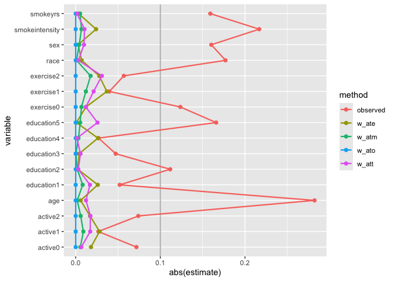
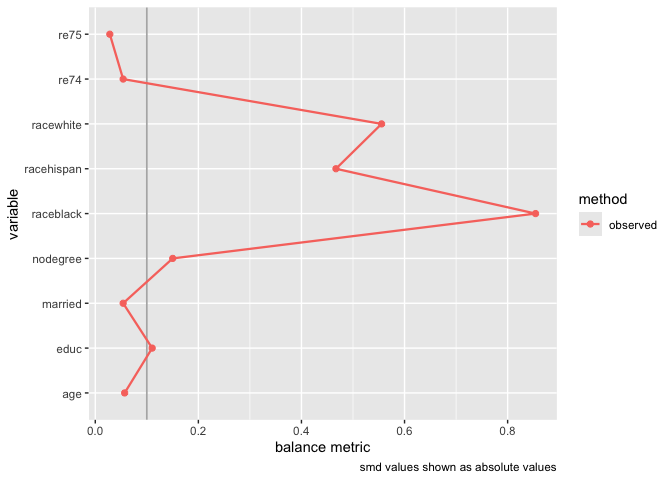

<!-- README.md is generated from README.Rmd. Please edit that file -->

# halfmoon 

<!-- badges: start -->

[](https://github.com/r-causal/halfmoon/actions/workflows/R-CMD-check.yaml)
[](https://app.codecov.io/gh/malcolmbarrett/halfmoon?branch=main)
[](https://lifecycle.r-lib.org/articles/stages.html#experimental)
<!-- badges: end -->

> Within light there is darkness, but do not try to understand that
> darkness. Within darkness there is light, but do not look for that
> light. Light and darkness are a pair like the foot before and the foot
> behind in walking.

– From the Zen teaching poem
[Sandokai](https://en.wikipedia.org/wiki/Sandokai).

The goal of halfmoon is to cultivate balance in propensity score models.

## Installation

You can install the most recent version of halfmoon from CRAN with:

``` r
install.packages("halfmoon")
```

You can also install the development version of halfmoon from
[GitHub](https://github.com/) with:

``` r
# install.packages("devtools")
devtools::install_github("malcolmbarrett/halfmoon")
```

## Example: Weighting

halfmoon includes several techniques for assessing the balance created
by propensity score weights.

``` r
library(halfmoon)
library(ggplot2)

# weighted mirrored histograms
ggplot(nhefs_weights, aes(.fitted)) +
  geom_mirror_histogram(
    aes(group = qsmk),
    bins = 50
  ) +
  geom_mirror_histogram(
    aes(fill = qsmk, weight = w_ate),
    bins = 50,
    alpha = 0.5
  ) + scale_y_continuous(labels = abs)
```


``` r

# weighted ecdf
ggplot(
  nhefs_weights,
  aes(x = smokeyrs, color = qsmk)
) +
  geom_ecdf(aes(weights = w_ato)) +
  xlab("Smoking Years") +
  ylab("Proportion <= x")
```


``` r

# weighted SMDs
plot_df <- tidy_smd(
  nhefs_weights,
  race:active,
  .group = qsmk,
  .wts = starts_with("w_")
)

ggplot(
  plot_df,
  aes(
    x = abs(smd),
    y = variable,
    group = method,
    color = method
  )
) +
  geom_love()
```



## Example: Matching

halfmoon also has support for working with matched datasets. Consider
these two objects from the
[MatchIt](https://github.com/kosukeimai/MatchIt) documentation:

``` r
library(MatchIt)
# Default: 1:1 NN PS matching w/o replacement
m.out1 <- matchit(treat ~ age + educ + race + nodegree +
                   married + re74 + re75, data = lalonde)

# 1:1 NN Mahalanobis distance matching w/ replacement and
# exact matching on married and race
m.out2 <- matchit(treat ~ age + educ + race + nodegree +
                   married + re74 + re75, data = lalonde,
                   distance = "mahalanobis", replace = TRUE,
                  exact = ~ married + race)
```

One option is to just look at the matched dataset with halfmoon:

``` r
matched_data <- get_matches(m.out1)

match_smd <- tidy_smd(
  matched_data,
  c(age, educ, race, nodegree, married, re74, re75), 
  .group = treat
)

love_plot(match_smd)
```



The downside here is that you can’t compare multiple matching strategies
to the observed dataset; the label on the plot is also wrong. halfmoon
comes with a helper function, `bind_matches()`, that creates a dataset
more appropriate for this task:

``` r
matches <- bind_matches(lalonde, m.out1, m.out2)
head(matches)
#>      treat age educ   race married nodegree re74 re75       re78 m.out1 m.out2
#> NSW1     1  37   11  black       1        1    0    0  9930.0460      1      1
#> NSW2     1  22    9 hispan       0        1    0    0  3595.8940      1      1
#> NSW3     1  30   12  black       0        0    0    0 24909.4500      1      1
#> NSW4     1  27   11  black       0        1    0    0  7506.1460      1      1
#> NSW5     1  33    8  black       0        1    0    0   289.7899      1      1
#> NSW6     1  22    9  black       0        1    0    0  4056.4940      1      1
```

`matches` includes an binary variable for each `matchit` object which
indicates if the row was included in the match or not. Since
downweighting to 0 is equivalent to filtering the datasets to the
matches, we can more easily compare multiple matched datasets with
`.wts`:

``` r
many_matched_smds <- tidy_smd(
  matches,
  c(age, educ, race, nodegree, married, re74, re75), 
  .group = treat, 
  .wts = c(m.out1, m.out2)
) 

love_plot(many_matched_smds)
```


We can also extend the idea that matching indicators are weights to
weighted mirrored histograms, giving us a good idea of the range of
propensity scores that are being removed from the dataset.

``` r
# use the distance as the propensity score
matches$ps <- m.out1$distance

ggplot(matches, aes(ps)) +
    geom_mirror_histogram(
        aes(group = factor(treat)),
        bins = 50
    ) +
    geom_mirror_histogram(
        aes(fill = factor(treat), weight = m.out1),
        bins = 50,
        alpha = 0.5
    ) + scale_y_continuous(labels = abs)
```


